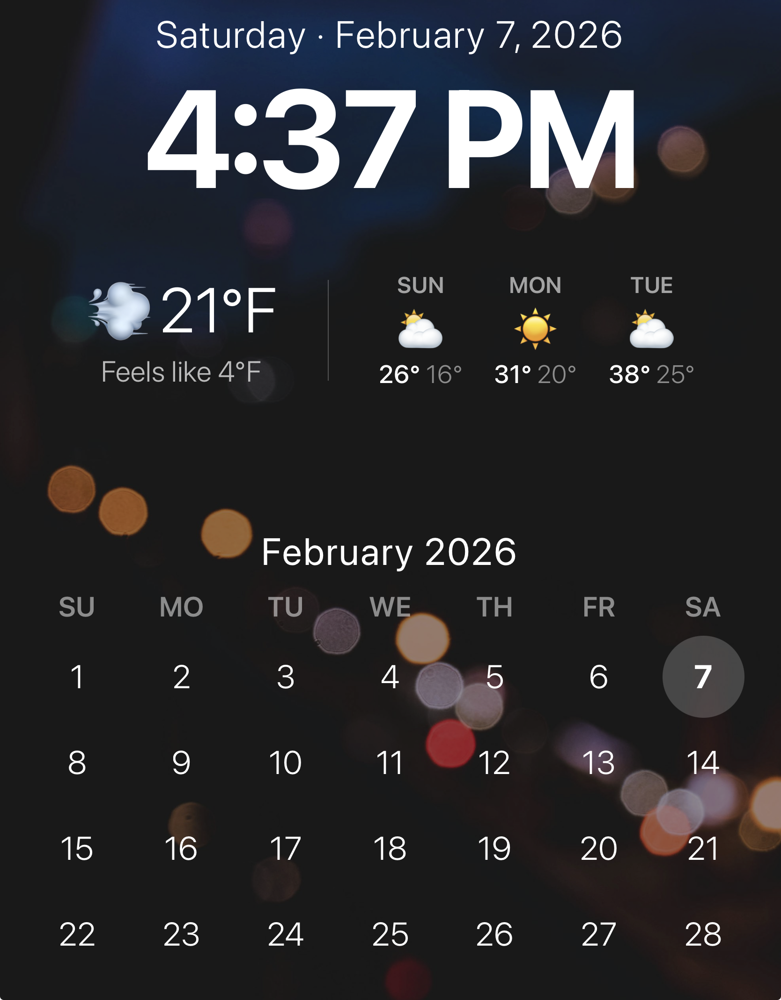

# Dashboard

A clean, self-contained web dashboard designed for a vertically-mounted monitor. Zero dependencies, zero build step — just a single HTML file with embedded CSS and vanilla JS.

I tried Dakboard, and MagicMirror, and while both had great options, and a lot of extensibility, neither was able to do exactly what I wanted. Dakboard might have with the paid plan, but I didn't feel like paying just to have such a simple dashboard that didn't need any of the advanced integrations that make Dakboard and MagicMirror so appreciated by the people who do use the advanced features.

A simple display of date and time, weather with a 3-day forecast, and a calendar with no personal information, is all I wanted.



## Features

- **Clock** — large, updates every second, 12 or 24-hour format
- **Date** — day of week and full date on a single line
- **Weather** — current conditions with icon, temperature, and "feels like" plus a 3-day forecast (via [PirateWeather](https://pirateweather.net/))
- **Calendar** — current month grid with today highlighted
- **Background image** — full-bleed with dark overlay for text contrast
- **Auto-scaling** — all elements scale proportionally to fit any browser size, from phones to large monitors

## Requirements

- A web server (nginx, Apache, or `python3 -m http.server` for testing)
- A [PirateWeather](https://pirateweather.net/) API key (free)
- **Linux/Raspberry Pi only:** install `fonts-noto-color-emoji` for weather emoji to render:

  ```sh
  sudo apt install fonts-noto-color-emoji
  ```

## Setup

1. Copy the example config and fill in your values:

   ```sh
   cp config.js.default config.js
   ```

2. Edit `config.js`:
   - Get a free API key from [PirateWeather](https://pirateweather.net/)
   - Set your latitude and longitude
   - Adjust units, time format, etc.

3. Drop a `background.jpg` in the project directory (any resolution — it will be scaled to cover the screen).

4. Serve with any web server:

   ```sh
   python3 -m http.server 8080
   ```

   Then open `http://localhost:8080` in a browser.

## Raspberry Pi Kiosk Setup

To run the dashboard on a Raspberry Pi in full-screen kiosk mode:

1. Clone the repo on the Pi and set up your config:

   ```sh
   git clone https://github.com/tksunw/SimpleDashboard.git
   cd SimpleDashboard
   cp config.js.default config.js
   # edit config.js with your API key, coordinates, etc.
   # add your background.jpg
   ```

2. Run the setup script:

   ```sh
   ./setup-pi.sh
   ```

   This installs nginx and emoji fonts, deploys the dashboard to `/var/www/html`, configures Chromium to launch in kiosk mode on boot, disables screen blanking, and hides the mouse cursor.

3. Reboot — the dashboard starts automatically.

To exit kiosk mode: `Alt+F4`, or SSH in and run `pkill chromium`.

To update files later:

```sh
sudo cp config.js background.jpg index.html /var/www/html/
```

## Configuration

All settings are in `config.js`:

| Setting | Description | Default |
|---|---|---|
| `weatherApiKey` | PirateWeather API key | — |
| `weatherLat` | Latitude | — |
| `weatherLon` | Longitude | — |
| `weatherUnits` | `'us'` (Fahrenheit) or `'si'` (Celsius) | `'us'` |
| `weatherRefreshMin` | Minutes between weather updates | `15` |
| `backgroundImage` | Path to background image | `'background.jpg'` |
| `timeFormat` | `12` or `24` hour clock | `12` |

## Files

| File | Tracked | Purpose |
|---|---|---|
| `index.html` | Yes | Dashboard (HTML + CSS + JS) |
| `config.js.default` | Yes | Example config with placeholder values |
| `config.js` | No | Your actual config (gitignored) |
| `background.jpg` | No | Your background image (gitignored) |
| `setup-pi.sh` | Yes | Raspberry Pi kiosk setup script |
